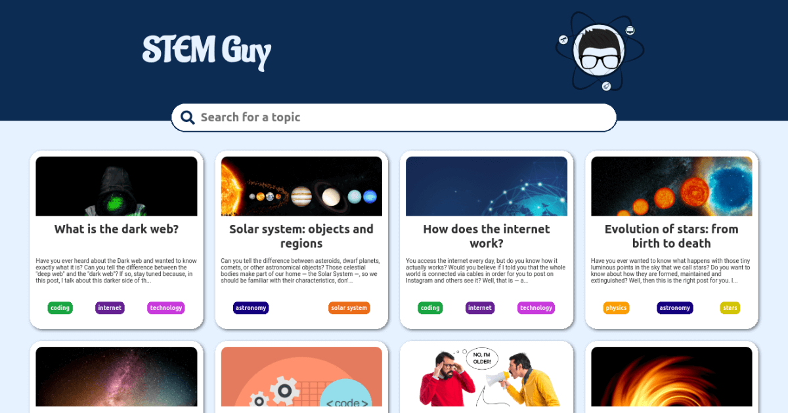

# STEM Guy

The STEM Guy club is a blog about science and technology.

This is the API of it, which is available at [api.stemguy.club](https://api.stemguy.club).

## Features

- Read articles written with Markdown

## Technologies

- [JavaScript](https://www.javascript.com)
- [TypeScript](https://www.typescriptlang.org)
- [Node.js](https://nodejs.org/en/)
- [Express](https://expressjs.com)
- [MongoDB](https://www.mongodb.com)

## Associated repositories

- [stemguy](https://github.com/iago-mendes/stemguy)
	> Main website
- [stemguy-admin](https://github.com/iago-mendes/stemguy-admin)
	> Administration system
- [stemguy-links](https://github.com/iago-mendes/stemguy-links)
	> Landing page with links
- [stemguy-posts](https://github.com/iago-mendes/stemguy-posts)
	> Articles in Markdown